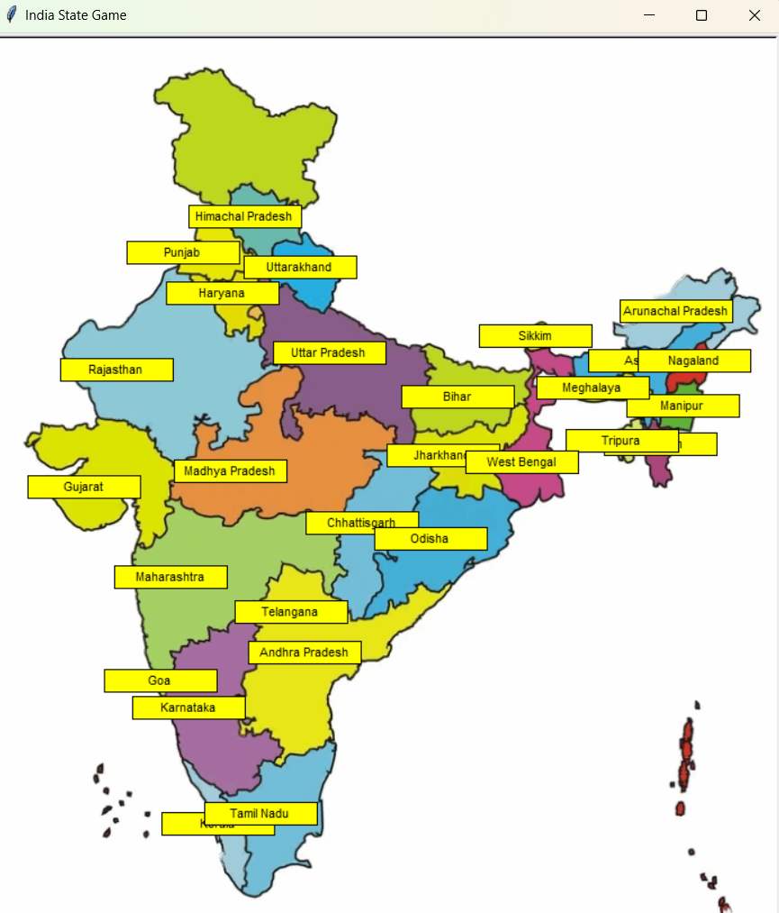

# India States Game 🗺️

This is an interactive game built using Python and the Turtle module, where the player needs to guess the names of all 28 states of India. As the player guesses each state's name correctly, it is displayed on the map with a yellow background.

## Features
- Interactive map of India.
- Players can input state names, and correct guesses are shown on the map with a yellow background.
- If the player enters "Exit," the remaining states are displayed on the map.
- Data on the states' coordinates is pulled from a CSV file for accurate placement on the map.

## Screenshots


## Getting Started

### Prerequisites
Make sure you have Python installed along with the following libraries:
- `turtle`
- `pandas`

You can install the `pandas` library using pip:

```bash
pip install pandas
```

## Installation
To run this game, you'll need Python installed on your system. The game uses the Turtle graphics library, which is included in the Python standard library.
1. **Clone the Repository**:
   ```bash
   git clone https://github.com/tusharharyana/India-State-Guessing-Game.git
   ```
2. Make sure you have Python installed. You can download it from [python.org](https://www.python.org/).

3. Run the game:
    ```bash
    python main.py
    ```
## Contributing

Feel free to open issues or submit pull requests if you have suggestions for improvements or enhancements.


## Contact

For any questions or feedback, please reach out to [haryanatushar@gmail.com](mailto:haryanatushar@gmail.com).    